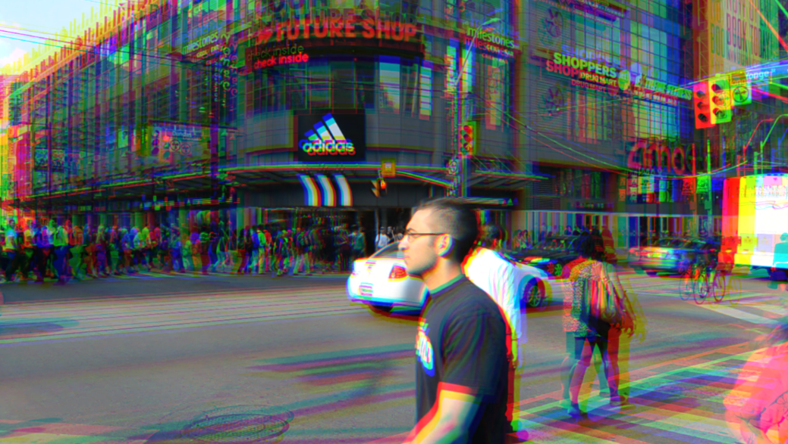

# Quiz 8 - Design Research

## Part 1: Imaging Technique Inspiration
I was inspired by "Spider-Man: Into the Spider-Verse", especially its visual expression method of "multiverse characters corresponding to different art styles". Each Spider-Man in the film has a unique artistic style, such as black-and-white comics, Japanese anime, 3D cartoons, etc., which are highly recognizable.

I hope to draw on this "style layering" strategy in my project, allowing different characters or states to express different backgrounds and emotions by switching image styles.

## Part 2: Coding Technique Exploration
In order to achieve the effect of different characters corresponding to different drawing styles, I choose to use the built-in 'filter()' function provided by **p5.js**. This function allows multiple preset filters to be applied to the canvas, such as GRAY, INVERT, BLUR, etc., thus easily achieving the switching of image styles.

By dynamically invoking different filters when the user interacts with the character, the unique visual style of the character in different universes can be simulated. For example, when a user selects a specific character, the screen automatically applies the corresponding filter to enhance the personalized expression of the character.

[https://p5js.org/examples/3d-filter-shader/](https://p5js.org/examples/3d-filter-shader/)